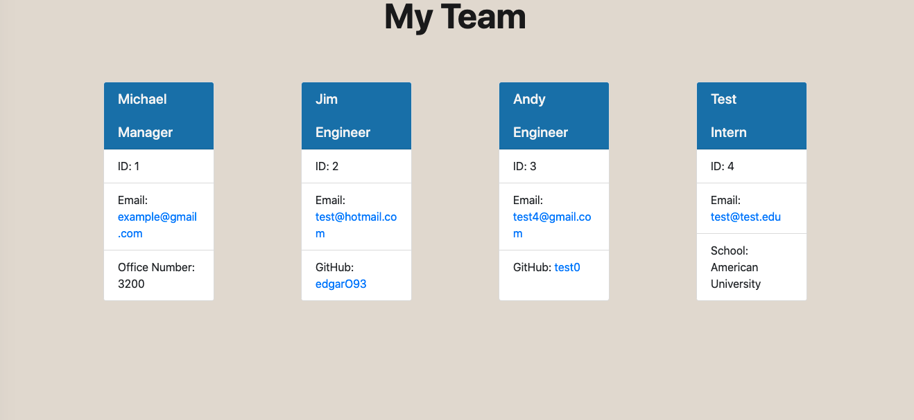

# Team Profile Generator
[](https://opensource.org/licenses/MIT)

## Description
This Team Profile Generator is powered by Node.js, JavaScript, jQuery and dynamic HTML. By answering some prompts, users will be able to create an HTML file that will create a team profile for each person entered. This project allowed me get more experience working with packages such as Jest and Inquirer. By building on the knowledge learned on the README Generator, I was able to use that experience to execute this project. This project assumes there will only be one manager, so in future updates I would like to expand the manager list and add other roles. I also would like to expand the template styling to have more features such as transitions or animations.

## Table of Contents

- [Installation](#installation)
- [Usage](#usage)
- [Contributing](#contributing)
- [Tests](#tests)
- [Screenshot](#screenshot)
- [Video](#video)
- [License](#license)
- [Questions](#questions)
- [Acknowledgments](#acknowledgments)

### Installation
After downloading this repository, go into the folder of this project. Then run npm install or i.

### Usage
You can then run the program by running node index.js and you will see prompts start appearing. You can also see the tests by running npm test.

### Contributing
Feel free to fork or clone this repo and make your own versions.

### Tests
You can run tests for the employee classes  by running npm test. This will test the Manager, Intern,Employee and Engineer classes. View of tests below.

 

###  Screenshot 
Sample HTML 



View of Terminal


## Video


<a href ="https://watch.screencastify.com/v/Luc1ElbKFPmT6gxvXGKF" target= "_blank" > Link to video. </a> 


###  License

Copyright &copy; 2021 Edgar Ortega

This project is licensed under the terms of the <a href="https://opensource.org/licenses/MIT" target= "_blank" > MIT </a> license.

### Questions

Send questions to edort93@gmail.com or visit <a href="https://github.com/edgarO93" target= "_blank" >my profile </a><br>

### Acknowledgments

```
I would like to thank online resources such as W3 schools, MDN Web Docs, and Stack Overflow.
```